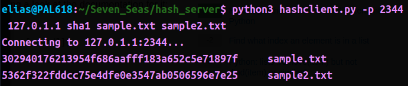
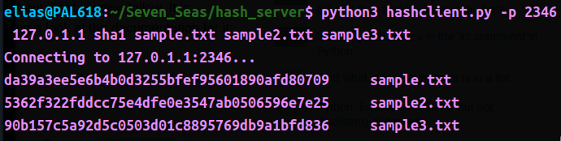

# Data Hashing Network

## To Run:

In one terminal tab, run `python3 server.py.` If desired, a -p tag can be added to specify a different server port.

In another tab, run `python3 hashclient.py -p 2345 127.0.1.1 sha1 file_to_hash`

To run the hash client, the port is optional, but the arguments that follow are mandatory. The IP address can be changed at will. sha1 is one of four available hashing algorithms, alongside sha256, sha512, and md5. Only one algorithm can be chosen at a time. Any amount of files to hash may be added as a command line argument.

## Readout:

In the client terminal, the response should be a hash hexcode followed by the name of the file that hex code corresponds to.

## Known Errors:

Occasionally, the socket will time out or close before the data has successfully traversed the connection. In this case, I have restarted the server on a separate port and tried again.

The hashes produced are mostly deterministic, but a single file will occasionally vary among one of two hex codes depending on data 'noise' the socket does not erase around the file contents.

## Future Solutions:

These errors are the product of an incompletely developed protocol for communication between the hash client and the server. In the future, I would refine that element of this program, dividing content into more functions and asynchronous blocks in order to better manage the flow of data through the TCP/IP stream.
